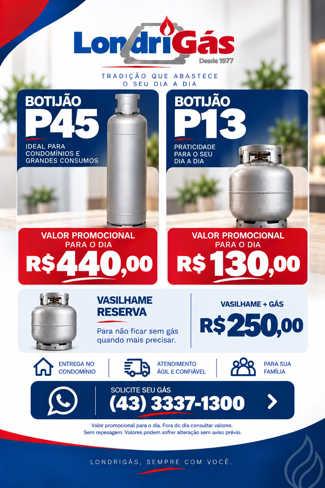

# Promoção-Londrigas
<!DOCTYPE html>
<html lang="pt-BR">
<head>
  <meta charset="UTF-8">
  <meta name="viewport" content="width=device-width, initial-scale=1.0">

  <title>Promoção LondriGás</title>

  <!-- Compartilhamento no WhatsApp, Facebook e LinkedIn -->
  <meta property="og:title" content="Promoção LondriGás">
  <meta property="og:description" content="Peça seu gás com desconto especial pelo WhatsApp!">
  <meta property="og:image" content="https://SEU-DOMINIO.com/poster-da-promocao.jpeg">
  <meta property="og:url" content="https://SEU-DOMINIO.com">
  <meta property="og:type" content="website">
  <meta property="og:image:width" content="1200">
  <meta property="og:image:height" content="630">

  <!-- Compartilhamento no X/Twitter -->
  <meta name="twitter:card" content="summary_large_image">
  <meta name="twitter:title" content="Promoção LondriGás">
  <meta name="twitter:description" content="Peça seu gás com desconto especial pelo WhatsApp!">
  <meta name="twitter:image" content="https://SEU-DOMINIO.com/poster-da-promocao.jpeg">

  
</head>

<body>
  <main class="poster">
    

    <a
      class="whatsapp"
      href="https://api.whatsapp.com/send/?phone=554333371300&text=Ola%2C%20gostaria%20de%20mais%20informacoes%20sobre%20a%20promocao.&type=phone_number&app_absent=0"
      target="_blank"
      rel="noopener noreferrer"
    >
      📲 Peça pelo WhatsApp
    </a>
  </main>
</body>
</html>